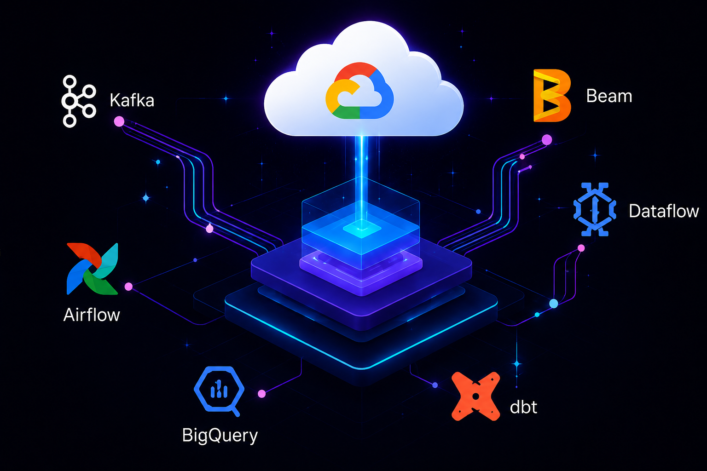

# Hi there 👋

<h1>
  Jonu
   Chauhan
</h1>

### 🔷 Senior Data Engineer

📍 Helsinki, Finland &nbsp;|&nbsp; ✉️ jonuchauhan@gmail.com &nbsp;|&nbsp; 🔗 [linkedin.com/in/jonu.Chauhan](https://linkedin.com/in/jonu.Chauhan)

 

> 💬 *Building scalable data platforms that turn data into **real-time insights** and business impact.*

 

---

## 👤 ABOUT ME

<table border="0">
  <tr>
    <td width="60%" valign="top">
      Senior Data Engineer with <b>12+ years</b> of experience designing and building cloud-native data platforms and enterprise data solutions.  
      I specialize in building batch and streaming data pipelines, event-driven architectures, ELT/ETL systems and leading cloud migration initiatives on <b>Google Cloud Platform</b>.  
      Passionate about creating scalable, reliable and cost-effective data platforms that empower analytics and drive business outcomes.
    </td>
    <td width="40%" valign="top">
      <b>&lt;/&gt; WHAT I DO</b>  
      ✅ Data Platform Architecture 
      ✅ Streaming & Batch Processing 
      ✅ ELT/ETL Pipeline Engineering 
      ✅ Cloud Migration & Modernization 
      ✅ Infrastructure Automation (IaC) 
      ✅ Data Modeling & Analytics Enablement 
      ✅ Data Reliability & Performance Tuning
    </td>
  </tr>
</table>

 

| 🚀 12+ | 🏢 Enterprise | 🤝 Cross-functional |
|:---:|:---:|:---:|
| **Years of Experience** | **Scale Solutions** | **Collaboration** |

---

## 🌐 CONNECT WITH ME

---

## 🛠️ TECH STACK

### ☁️ Cloud & Infrastructure

### ⚙️ Data Engineering

### 💻 Languages & Databases

&nbsp;&nbsp;&nbsp;|&nbsp;&nbsp;&nbsp;

### 📊 Analytics & BI

---

## 🏆 CERTIFICATIONS

 

<table border="0">
  <tr>
    <td align="center" width="150">
      
       <b>Google PDE</b>
    </td>
    <td align="center" width="150">
      
       <b>CKAD</b>
    </td>
    <td align="center" width="150">
      
       <b>Terraform</b>
    </td>
    <td align="center" width="150">
      
       <b>Cloudera</b>
    </td>
  </tr>
</table>

---

 *"Code. Build. Automate. Analyze. **Optimize**. Repeat."* ✨

